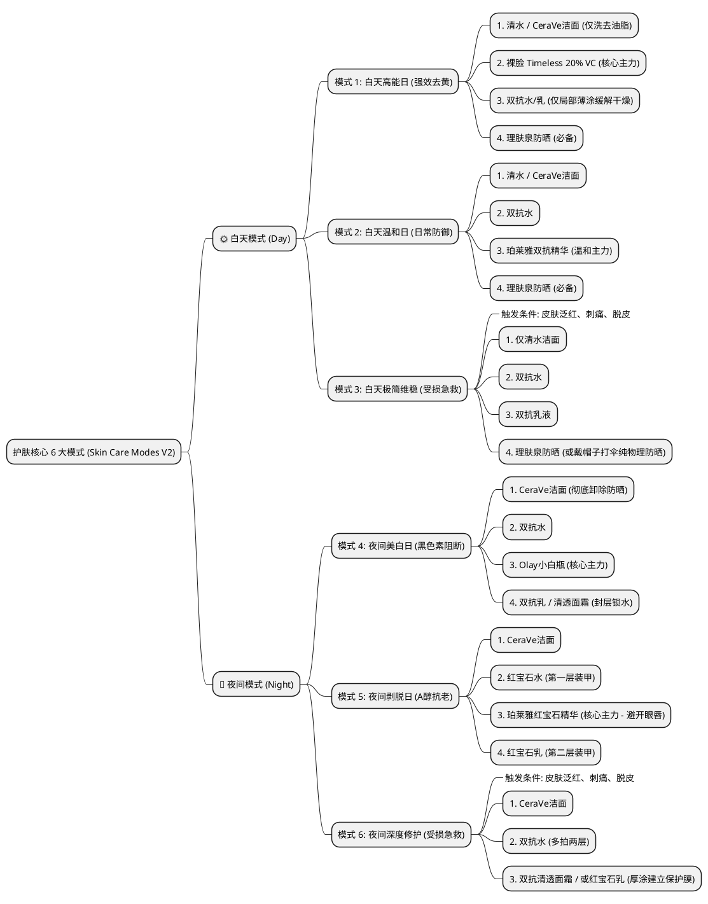

# Carbon Typst Blog

Carbon Typst Blog 是一个基于 Typst 的静态博客生成器，旨在提供一个简洁、高效的博客构建流程。通过使用 Node.js 脚本进行构建，支持多线程加速和预览构建，适合个人博客或小型项目使用。

## 如何使用

1. 克隆仓库到本地：

  ```bash
  git clone https://github.com/tiger2005/carbon-typst-blog
  cd carbon-typst-blog
  ```

2. 确认已安装 Node.js 和 Typst 环境，本模板目前无需用 `npm install` 安装依赖。

3. 通过 `npm run build` 命令构建博客，生成的静态文件将输出到 `_site/` 目录。

这样就完成了博客的安装和构建，接下来可以根据需要进行预览或部署。例如，你可以在本地启用 Live Server 来预览生成的站点，并查看已经编写好的博客指引文章。



另外，本模板同时包含了简单的 GitHub Actions 工作流配置，可以在推送代码后自动构建并部署到 GitHub Pages，方便持续更新博客内容。

## 编写文章

如果你需要添加或更改文章，对应的流程如下：

- 在 `posts/` 目录下创建新的文章文件夹，例如 `posts/my-new-post/`，并在其中添加 `index.typ` 文件。
- 在 `index.typ` 中编写文章内容，使用 Typst 语法进行格式化。**你可以在本地通过 Typst 预览插件查看大致的渲染效果。**
- 完成编辑后，使用构建命令生成站点：
  ```bash
  npm run build:preview
  ```

  生成的结果将输出到 `_site-preview/` 目录，方便你预览效果。
- 当你对预览结果满意后，可以使用常规构建命令 `npm run build` 来生成最终的站点。

## 其他问题

如果你对构建流程有任何疑问，或者在使用过程中遇到问题，可以参考博客指引文章，其中包含了更详细的说明和常见问题解答。此外，欢迎在 GitHub 仓库中提交 issue。